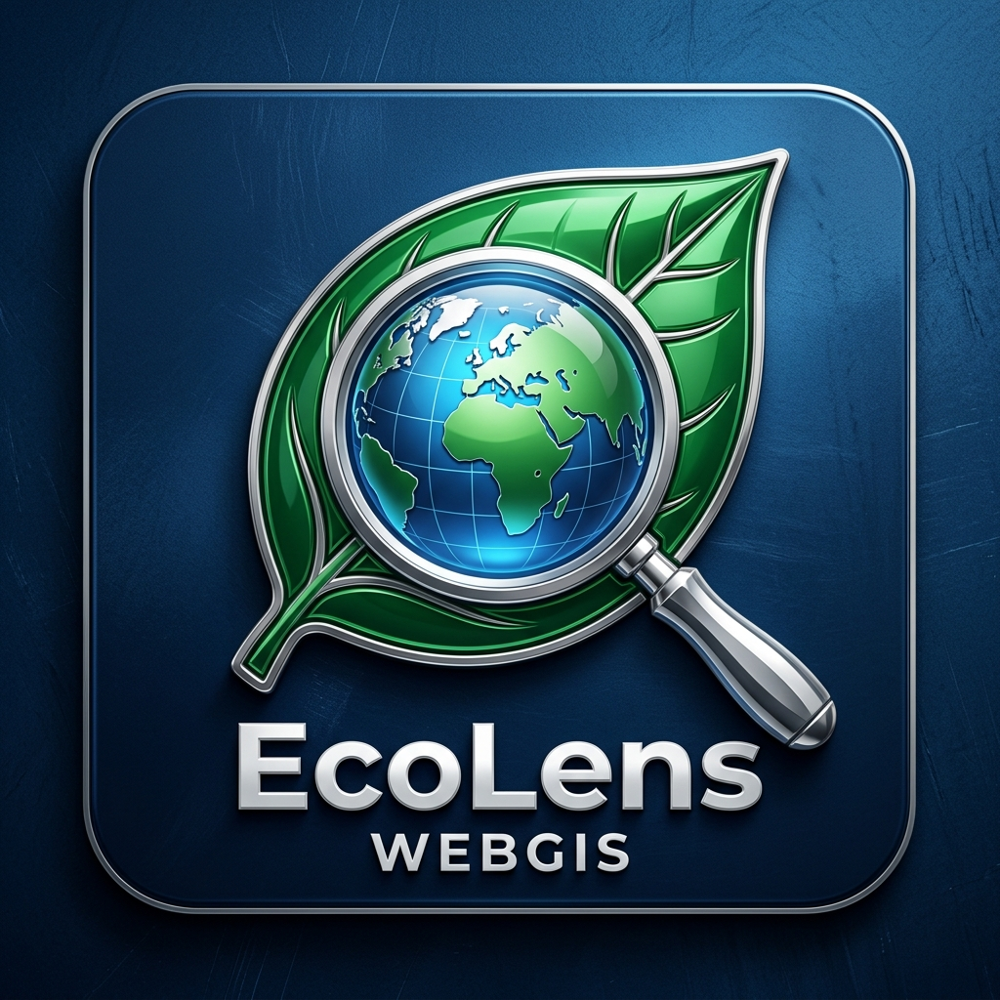

<<<<<<< HEAD
# EcoLens WebGIS
=======
<div align="center">
  
  <h1>EcoLens WebGIS</h1>
  <p>
    <a href="https://saimsuhailqu.github.io/ecolens-github/" target="_blank">
      
    </a>
    
    
  </p>
</div>
>>>>>>> 069af80 (docs: add logo, badges, live demo link, and FYP team section to README)

EcoLens WebGIS is an advanced, cloud-powered geospatial workstation designed for real-time regional environmental monitoring, climate analysis, and drought assessment. Built as a Final Year Project (FYP), it leverages the massive computational power of Google Earth Engine directly in the browser to make satellite data analysis accessible, fast, and interactive.

## 🌐 Live Demo
Access the live application here: **[EcoLens WebGIS Live](https://saimsuhailqu.github.io/ecolens-github/)**

## 🌟 Key Features

* **Cloud-Powered Computation:** Direct integration with the Google Earth Engine (GEE) API to process petabytes of public satellite imagery (Copernicus Sentinel-2, Landsat 8, ERA5 Climate Data) in real-time without requiring high-end local hardware.
* **Dynamic Spatial Selection:** Analyze environments by selecting administrative boundaries down to the Tehsil level, or by drawing custom polygons directly on the interactive map.
* **Comprehensive Environmental Indices:** Calculate and visualize over 30 spectral and climate indices across multiple categories:
  * **Vegetation:** NDVI, SAVI, EVI, MSAVI
  * **Water:** NDWI, MNDWI
  * **Heat:** Land Surface Temperature (LST), Urban Heat Island (UHI) footprint
  * **Climate & Drought:** Monthly Temperature, Rainfall, PDSI (Palmer Drought Severity Index)
* **Time-Series Analytics:** Automatically generates monthly time-series charts to track environmental trends over a selected year.
* **Land Use & Land Cover (LULC):** Instant land cover classification and distribution charting using the Dynamic World dataset.
* **Export Capabilities:** Export processed high-resolution GeoTIFF satellite maps and statistical CSV reports for offline research.

## 🚀 Tech Stack
* **Frontend Framework:** React (Vite)
* **Styling:** Tailwind CSS & Glassmorphism UI
* **Mapping:** Leaflet & React-Leaflet
* **Geospatial Engine:** Google Earth Engine JavaScript API
* **Data Visualization:** Recharts

## 🛠️ Run Locally

**Prerequisites:** Node.js (v18+)

1. Clone the repository and install dependencies:
   ```bash
   npm install
   ```
2. Set up your environment variables. Create a `.env.local` file in the root directory and add your Google OAuth Client ID:
   ```env
   VITE_GEE_OAUTH_CLIENT_ID=your_google_oauth_client_id_here
   VITE_GEE_PROJECT_ID=your_google_cloud_project_id_here
   ```
3. Run the development server:
   ```bash
   npm run dev
   ```

## 🔐 Authentication & Scopes
This application uses client-side Google OAuth to authenticate with Earth Engine. It strictly requests the `https://www.googleapis.com/auth/earthengine.readonly` scope. No user data or authentication tokens are stored on external servers. All processing is routed securely through the user's browser to Google's infrastructure.

## 👥 FYP Team & Collaborators
* **Saim Suhail Qureshi** (`saim.suhail.5@gmail.com`) - Lead Developer & Geospatial Architect
* **Muhammad Arsal** (`muhammadarsalattari@gmail.com`) - Co-Developer & Data Integration
