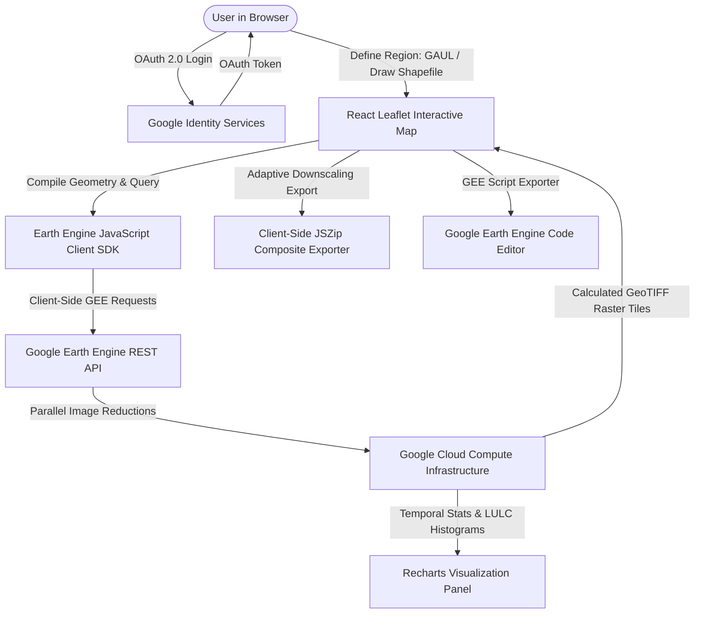

<div align="center">
  
  <h1>EcoLens WebGIS</h1>
  <p><strong>Cloud-Powered Geospatial Workstation for Regional Environmental Monitoring & Climate Analysis</strong></p>
  <p>
    <a href="https://saimsuhailqu.github.io/ecolens-github/" target="_blank">
      
    </a>
    
    
    
  </p>
</div>

---

## 🌐 Project Overview
**EcoLens WebGIS** is an advanced, high-performance geospatial analysis workstation designed for real-time regional environmental monitoring, climate trend tracking, and drought assessment. Developed as a Final Year Project (FYP), it democratizes access to satellite observation data by integrating the **Google Earth Engine (GEE) API** directly into a browser interface, removing the need for heavy desktop GIS software (like QGIS or ArcGIS Pro).

Users can analyze pre-defined administrative boundaries (from country-level down to local sub-districts/tehsils) or draw custom regions of interest to compute over **35 spectral indices**, generate temporal trend charts, visualize Land Use Land Cover (LULC) distributions, and export custom multi-band GeoTIFF composites.

---

## 🏗️ System Architecture & Workflow

The platform leverages a serverless frontend architecture, delegating massive computational overhead directly to Google Cloud.



1. **Authentication Layer:** Client-side Google OAuth 2.0 authentication.
2. **Computational Layer:** Google Earth Engine REST API handles remote-sensing calculations (reducers, mapping, expressions).
3. **Visualization Layer:** React Leaflet overlays GEE raster tiles over Leaflet base maps; Recharts renders time-series metrics.
4. **Data Packaging:** JSZip structures raw raster GeoTIFF bands client-side.

---

## ⚙️ Core Engineering & Technical Highlights

During development, several complex geospatial engineering bottlenecks were resolved:

### 1. Client-Side OAuth Quota Delegation
*   **The Problem:** Using a single GEE Service Account for a public WebGIS causes rapid quota exhaustion and high cloud infrastructure costs.
*   **The Solution:** Implemented client-side OAuth 2.0 flow using the `earthengine-legacy` library. By requiring users to authenticate with their own Google Earth Engine-enabled accounts, GEE API limits are delegated to each individual user's active Google Cloud project. This makes the workstation serverless, infinitely scalable, and zero-cost to maintain.

### 2. Adaptive Resolution Scaling for Raster Exports
*   **The Problem:** GEE's on-the-fly raster download API (`getDownloadURL`) enforces a strict payload limit (max ~50MB and 100,000 pixels). Querying high-resolution Sentinel-2 (10m) data across an entire state or country results in a payload overflow and API failure.
*   **The Solution:** Developed a mathematical safeguard algorithm. The application calculates the bounding box area of the selected polygon in square meters. If the area exceeds the pixel limit threshold, the exporter dynamically downscales the output resolution (e.g., from 10m to 30m or 100m) using the formula:
    $$\text{Scale} = \max\left(\text{Base Scale}, \sqrt{\frac{\text{Bounding Box Area}}{\text{Max Allowed Pixels}}}\right)$$
    This ensures downloads always succeed, regardless of geometry size.

### 3. Dynamic Geometry Simplification
*   **The Problem:** Detailed administrative boundaries (FAO GAUL Level 2/3) or complex user-drawn polygons contain tens of thousands of vertices. Passing this raw geometry payload to GEE triggers `400 Bad Request` payload size errors.
*   **The Solution:** Built a pre-request vertex checker. For regions exceeding 50,000 km², a Douglas-Peucker simplification algorithm (`simplify()`) is dynamically applied. This reduces vertex density while preserving overall boundary integrity, ensuring clean REST payloads.

### 4. Asynchronous Parallel Data Pipelines
*   **The Problem:** Running multi-dataset spatial reductions (combining optical Sentinel-2, thermal Landsat, climate ERA5, and drought TerraClimate) over a 12-month series is computationally heavy, causing browser request timeouts.
*   **The Solution:** Implemented a pipeline utilizing `Promise.all` and client-side chunking. By partitioning GEE queries into monthly server-side tasks and resolving them asynchronously, the platform processes petabytes of satellite imagery in seconds.

---

## 📊 Supported Geospatial & Climate Indices

EcoLens compiles and calculates over 35 distinct indices dynamically using **Copernicus Sentinel-2 (10m)** and **Landsat 8/9 (30m)** datasets:

### Vegetation Indices
| Index | Name | Formula / Expression | Purpose |
| :--- | :--- | :--- | :--- |
| **NDVI** | Normalized Difference Vegetation Index | `(NIR - RED) / (NIR + RED)` | Standard indicator of green vegetation canopy health. |
| **EVI** | Enhanced Vegetation Index | `2.5 * ((NIR - RED) / (NIR + 6 * RED - 7.5 * BLUE + 1))` | Improved sensitivity in high-biomass regions. |
| **SAVI** | Soil-Adjusted Vegetation Index | `((NIR - RED) / (NIR + RED + 0.5)) * 1.5` | Corrects for soil background influences in sparse regions. |
| **OSAVI**| Optimized SAVI | `(NIR - RED) / (NIR + RED + 0.16)` | Simplified version of SAVI optimized for agricultural areas. |
| **GNDVI**| Green NDVI | `(NIR - GREEN) / (NIR + GREEN)` | Sensitive to chlorophyll concentration. |
| **MSAVI**| Modified SAVI | `(2 * NIR + 1 - sqrt((2 * NIR + 1)² - 8 * (NIR - RED))) / 2` | Minimizes soil noise for urban/desert transitions. |
| **GCVI** | Green Chlorophyll Vegetation Index | `(NIR / GREEN) - 1.0` | Estimates canopy chlorophyll content. |
| **NDRE** | Normalized Difference Red Edge | `(NIR - RE1) / (NIR + RE1)` | Early stress detection using Sentinel-2 Red Edge band. |
| **VARI** | Visible Atmospherically Resistant Index | `(GREEN - RED) / (GREEN + RED - BLUE)` | Vegetation fraction estimates using visible spectra only. |

### Water & Moisture Indices
| Index | Name | Formula / Expression | Purpose |
| :--- | :--- | :--- | :--- |
| **NDWI** | Normalized Difference Water Index | `(GREEN - NIR) / (GREEN + NIR)` | Detects open water bodies and tracks water surface changes. |
| **MNDWI**| Modified NDWI | `(GREEN - SWIR1) / (GREEN + SWIR1)` | Bypasses urban noise for superior water feature extraction. |
| **NDMI** | Normalized Difference Moisture Index | `(NIR - SWIR1) / (NIR + SWIR1)` | Monitors vegetation liquid water content and crop water stress. |
| **AWEInsh**| Automated Water Ext. Index (No Shadow) | `4 * (GREEN - SWIR1) - (0.25 * NIR + 2.75 * SWIR2)` | Accurately extracts water surfaces in non-shadowed terrain. |
| **AWEIsh**| Automated Water Ext. Index (Shadow) | `BLUE + 2.5 * GREEN - 1.5 * (NIR + SWIR1) - 0.25 * SWIR2` | Delineates water bodies in areas with urban or topographic shadows. |
| **WRI** | Water Ratio Index | `(GREEN + RED) / (NIR + SWIR1)` | High-ratio indicator for water delineation. |

### Burn, Soil, & Geological Indices
| Index | Name | Formula / Expression | Purpose |
| :--- | :--- | :--- | :--- |
| **NBR** | Normalized Burn Ratio | `(NIR - SWIR2) / (NIR + SWIR2)` | Maps burnt areas and assesses fire/burn severity. |
| **NBR2** | Normalized Burn Ratio 2 | `(SWIR1 - SWIR2) / (SWIR1 + SWIR2)` | Tracks long-term post-fire recovery and moisture loss. |
| **BAI** | Burn Area Index | `1.0 / ((0.1 - RED)² + (0.06 - NIR)²)` | Detects charcoal deposits and active fire scars. |
| **NDBI** | Normalized Difference Built-Up Index | `(SWIR1 - NIR) / (SWIR1 + NIR)` | Maps urban sprawl and artificial built-up densities. |
| **BSI** | Bare Soil Index | `((SWIR1 + RED) - (NIR + BLUE)) / ((SWIR1 + RED) + (NIR + BLUE))` | Quantifies soil exposure, ideal for desertification studies. |
| **NDSI** | Normalized Difference Snow Index | `(GREEN - SWIR1) / (GREEN + SWIR1)` | Differentiates snow cover from clouds. |
| **CLAY** | Clay Minerals Ratio | `SWIR1 / SWIR2` | Highlights clay and clay-rich soil deposits. |
| **ALUI** | Alunite Index | `SWIR1 / SWIR2` | Geological mapping for hydrothermal alteration zones. |

### Land Surface Temperature (LST) & Urban Heat Island (UHI)
*   **Land Surface Temperature (LST):** Calculated using Landsat 8/9 thermal infrared (Band 10) combined with dynamic emissivity estimations:
    $$\text{LST (°C)} = (T_b \times 0.00341802 + 149.0) - 273.15$$
*   **Urban Heat Island (UHI) Effect:** Measures thermal deviations in built environments. To calculate this seasonally:
    1.  Queries Dynamic World LULC to mask out built-up and water zones.
    2.  Identifies surrounding rural baselines (vegetated, bare soil).
    3.  Computes UHI as:
        $$\text{UHI} = \text{LST}_{\text{Pixel}} - \text{Mean}(\text{LST}_{\text{Rural Baseline}})$$

### Climate & Meteorological Trends
*   **PDSI (Palmer Drought Severity Index):** Queried from the `IDAHO_EPSCOR/TERRACLIMATE` dataset to monitor meteorological dryness.
*   **SPEI (Standardized Precipitation-Evapotranspiration Index):** Computed by evaluating the water balance anomaly ($D = \text{Precipitation (pr)} - \text{Potential Evapotranspiration (pet)}$) over monthly intervals.
*   **ERA5-Land Aggregations:** Integrates ECMWF total monthly precipitation and 2m air temperatures.

---

## 📈 LULC & Real-Time Analytics

By integrating Google’s **Dynamic World V1** (10m resolution deep-learning model), EcoLens analyzes land cover classification in real time:
1.  **Temporal Mode Reduction:** Instead of static classifications, it queries the exact user date range and applies a `mode()` reducer to determine the dominant pixel class over time.
2.  **Class Frequency Histograms:** Computes exact spatial coverages for 9 classes: *Water, Trees, Grass, Flooded Vegetation, Crops, Shrub & Scrub, Built Area, Bare Ground, and Snow/Ice*.
3.  **Visualization:** Data is dynamically mapped to responsive, interactive donut and bar charts using Recharts.

---

## 💾 Advanced Geospatial Exports

*   **Multi-band GeoTIFF Compiles:** Exports selected indices as layered bands in a single GeoTIFF file.
*   **ZIP Index Archives:** Generates compressed ZIP archives containing individual, uncompressed GeoTIFF rasters for separate indices.
*   **Vibrant GEE Script Exporter:** Automatically compiles the client's current setup (coordinates, date range, collection, index formulas) into a native JavaScript code block. Users can copy this block directly into the **Google Earth Engine Code Editor** to run independent cloud scripting.

---

## 🛠️ Run Locally

### Prerequisites
*   Node.js (v18.0.0 or higher)
*   npm (v9.0.0 or higher)
*   A Google account registered with Google Earth Engine (free for research/educational use).

### Setup & Installation

1.  **Clone the Repository:**
    ```bash
    git clone https://github.com/SaimSuhailQu/ecolens-github.git
    cd ecolens-github
    ```

2.  **Install Dependencies:**
    ```bash
    npm install
    ```

3.  **Configure Environment Variables:**
    Create a `.env.local` file in the root directory and add your Google Cloud credentials:
    ```env
    VITE_GEE_OAUTH_CLIENT_ID=your_google_oauth_client_id_here
    VITE_GEE_PROJECT_ID=your_google_cloud_project_id_here
    ```

4.  **Run Development Server:**
    ```bash
    npm run dev
    ```
    The application will launch on `http://localhost:5173` (or the configured host port).

5.  **Build for Production:**
    ```bash
    npm run build
    ```

---

## 🛡️ Authentication, Security & Compliance
This WebGIS application runs entirely in the user's browser (client-side execution):
*   **OAuth Security:** Leverages standard Google Identity Services authentication requesting only the read-only Earth Engine scope:
    `https://www.googleapis.com/auth/earthengine.readonly`
*   **Data Privacy:** No user tokens, locations, shapes, or API metadata are sent to external databases or third-party servers. All requests are routed securely to Google's cloud computing infrastructure.
*   **Regulatory Compliance:** Includes built-in Terms of Service (`/terms`) and Privacy Policy (`/privacy`) overlays necessary for passing GEE production verification scopes.

---

## 👥 FYP Team & Authors
*   **Saim Suhail Qureshi** ([saim.suhail.5@gmail.com](mailto:saim.suhail.5@gmail.com)) — Lead Developer & Geospatial Architect
*   **Muhammad Arsal** ([muhammadarsalattari@gmail.com](mailto:muhammadarsalattari@gmail.com)) — Co-Developer & Data Integration Specialist
